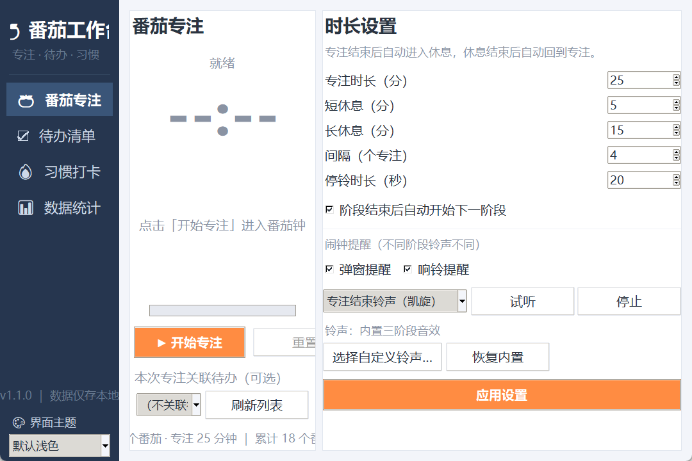
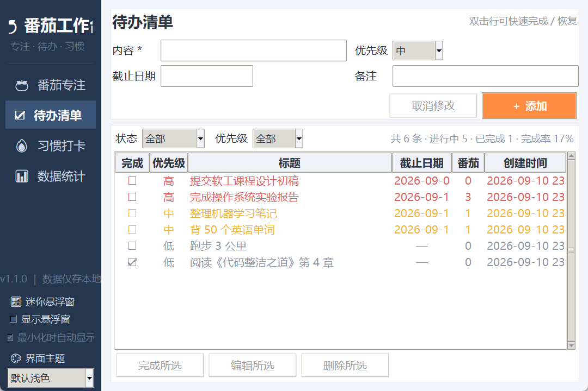
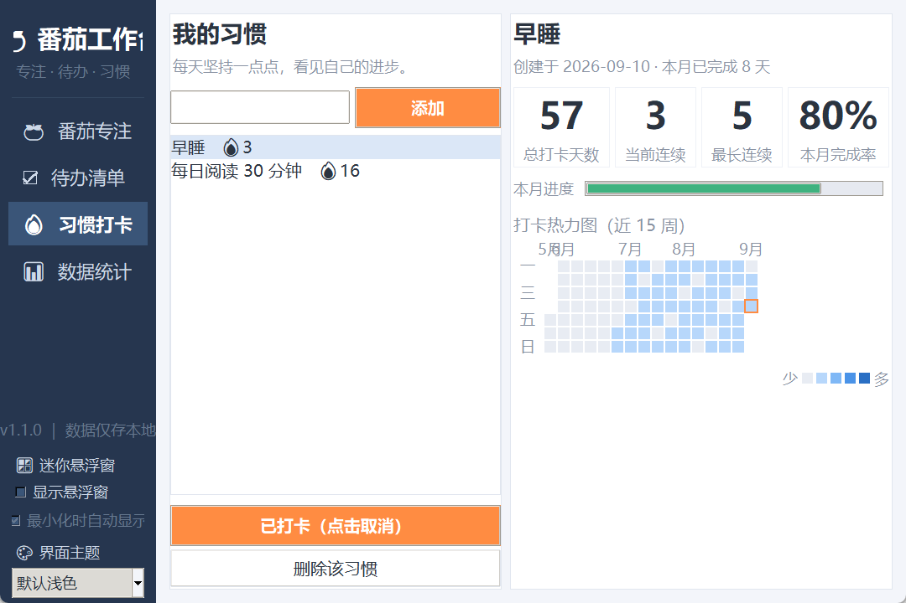
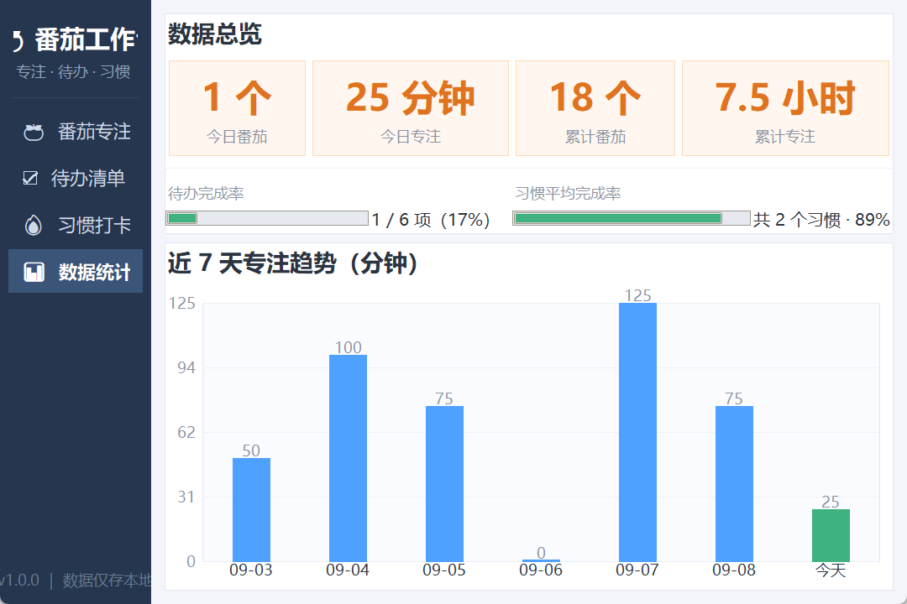
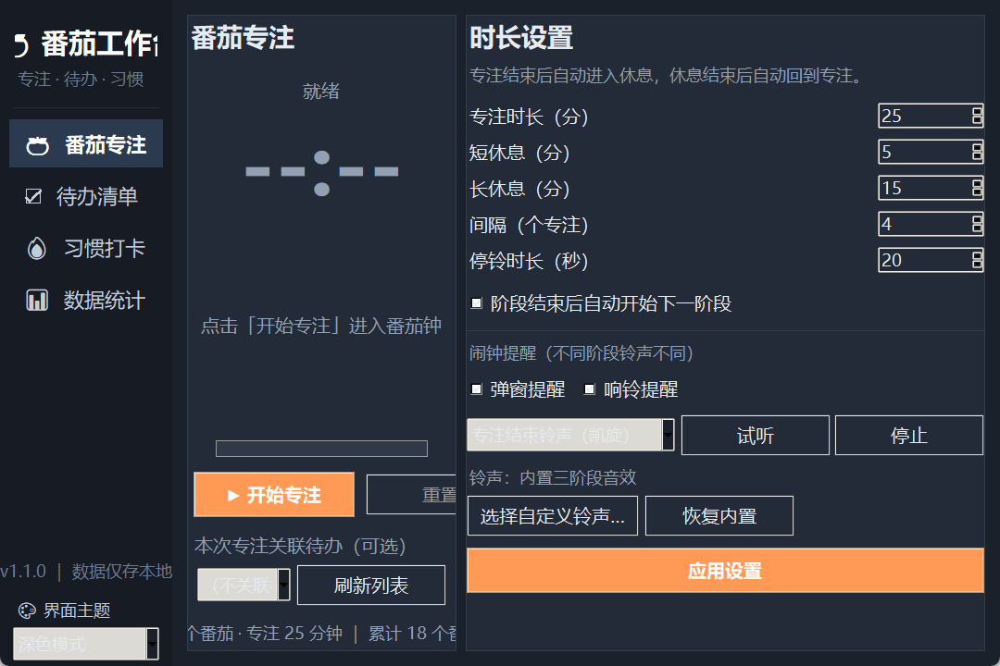
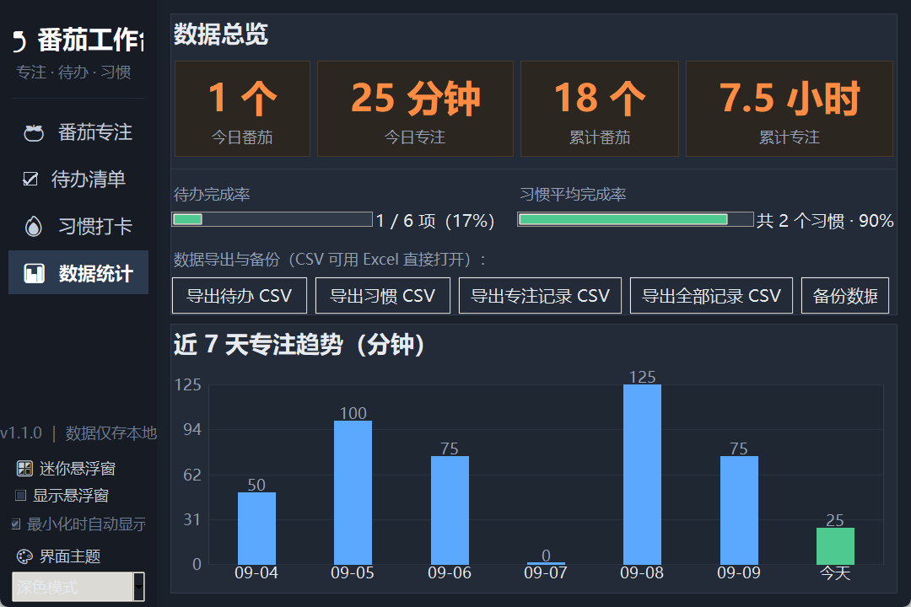
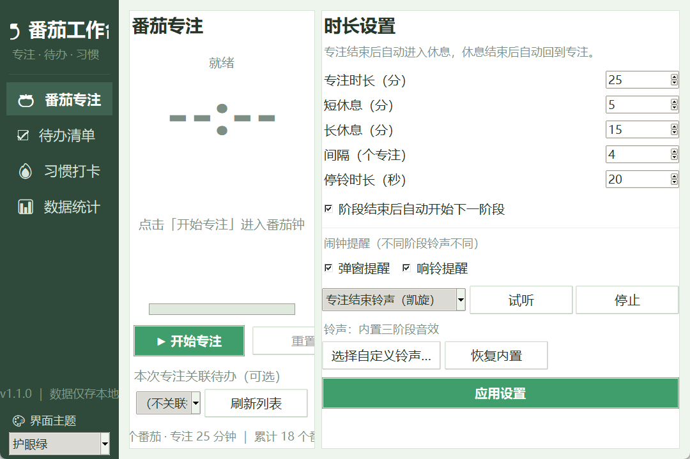
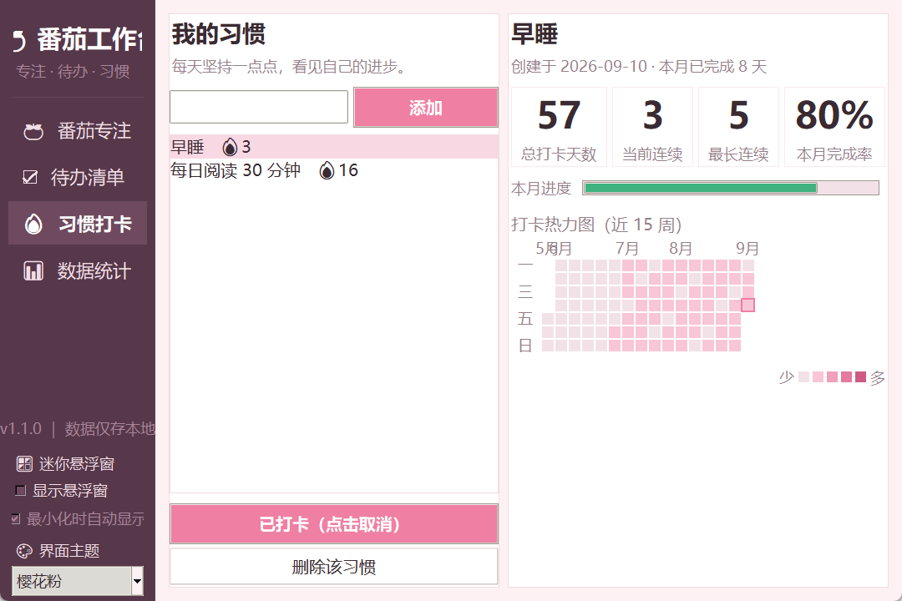

# 🍅 番茄工作台（Pomodoro Workbench）

[](https://github.com/GarryLiang/pomodoro-workbench/actions)
[](LICENSE)
[](https://www.python.org/)

> 一款**零第三方依赖**的本地桌面效率工具：番茄专注 + 待办清单 + 习惯打卡 + 数据统计，
> 全部由 Python 标准库（tkinter / sqlite3）实现，单机运行、数据仅存本地。
> **v1.2.0 新增：置顶迷你悬浮窗（最小化自动弹出）；v1.1.0 新增：4 套界面主题与可自定义闹钟提醒。**

番茄工作台把「专注计时、任务管理、习惯养成、数据回顾」整合进一个清爽的桌面程序中：
开始一次番茄专注 → 关联一条待办 → 完成后自动累计番茄数 → 每天坚持习惯打卡 →
打开统计页看到自己的专注趋势与进步曲线。

---

## 🖼 界面预览（真实运行截图）

| 番茄专注 | 待办清单 |
|---|---|
|  |  |

| 习惯打卡（热力图） | 数据统计 |
|---|---|
|  |  |

| 阶段结束提醒弹窗 | 深色主题 |
|---|---|
|  |  |

| 深色主题 · 统计 | 护眼绿主题 |
|---|---|
|  |  |

| 樱花粉主题 · 习惯打卡 | 迷你悬浮窗 |
|---|---|
|  |  |

> 截图由程序真实运行生成（见 `tools/make_screenshots.py`）。

---

## ✨ 功能特性

番茄工作台包含 **4 大功能模块**（专注 / 待办 / 习惯 / 统计）**+ 界面主题系统 + 迷你悬浮窗**：

### 1. 🍅 番茄专注（番茄钟）
- 经典番茄工作法：专注 25 分钟 → 短休息 5 分钟 → 每 4 个专注后长休息 15 分钟
- 专注 / 短休息 / 长休息时长均可自定义，长休息间隔可调
- 开始、暂停、继续、重置、跳过完整控制
- **⏰ 可自定义的闹钟提醒**（v1.1 增强）：
  - 弹窗提醒与响铃提醒**可分别开关**
  - **随时试听**三种阶段铃声；自动停铃时长可调（5~120 秒）
  - 支持**使用自己的 WAV 铃声文件**替代内置音效
  - 内置三阶段专属音效：专注结束凯旋琶音、短休息柔和双音、长休息冲刺号角，
    全部由标准库现场合成，无需任何音频素材
- 可开关「自动开始下一阶段」；每个完成的专注自动写入数据库并计入统计

### 2. 🎨 界面主题（v1.1 新增）
- **4 套主题一键切换**：默认浅色 / 深色模式 / 护眼绿 / 樱花粉（侧边栏切换，重启保持）
- 深色模式下热力图、趋势图、卡片、弹窗全部适配，夜间使用不刺眼

### 3. 🪟 迷你悬浮窗（v1.2 新增）
- **主窗口最小化后自动弹出**（可关闭该行为），也可在侧边栏手动勾选开关
- 约 240×160 像素的无边框置顶小窗：显示当前阶段、剩余时间与进度条
- 内置快捷操作：**开始 / 暂停**、**跳过当前阶段**、**一键返回主界面**
- 可**鼠标拖动**到屏幕任意位置，位置自动记忆；点 × 或右键可隐藏
- 配色跟随当前主题，切换主题后自动重建

### 4. ☑ 待办清单
- 新增 / 编辑 / 删除待办，支持优先级（高/中/低）与截止日期（YYYY-MM-DD）
- 完成 / 恢复一键切换（双击行也可），支持按状态、优先级筛选
- **与番茄钟联动**：专注前选择一条待办，完成后该待办自动 +1 番茄，用于量化投入
- 逾期任务红色提醒，顶部实时显示完成率

### 5. 🔥 习惯打卡
- 自由添加/删除习惯，每日一键打卡
- 自动统计总打卡天数、当前连续天数、最长连续天数、本月完成率
- **GitHub 风格打卡热力图**：连续性和自律程度一目了然

### 6. 📊 数据统计
- 今日/累计番茄数与专注分钟数总览
- 近 7 天专注趋势柱状图（自绘 Canvas，无图表库依赖）
- 待办完成率、习惯平均完成率实时进度条
- **💾 数据导出与备份**：一键导出待办 / 习惯 / 专注记录为 CSV
  （Excel 可直接打开），数据库一键备份与还原

---

## 🔧 环境要求

- Windows / macOS / Linux 桌面系统
- **Python 3.10 及以上**（程序在 Python 3.12 上开发与测试）
- 无需安装任何第三方包，仅使用标准库

> 检查 Python：在命令行执行 `python --version`。Windows 用户注意不要使用
> Microsoft Store 的占位版 `python.exe`，请到 https://www.python.org/downloads/
> 安装并勾选 *Add Python to PATH*。

---

## 🚀 快速开始（一键）

> 无需任何第三方 Python 包。用户只需要 **Python 3.10+**（含 tkinter），
> 没有的话脚本会帮你自动安装。

**💾 Windows ** 直接下载已打包的独立程序（约 12MB，免安装）：
[⬇️ 下载 PomodoroWorkbench.exe](https://github.com/GarryLiang/pomodoro-workbench/releases/latest/download/PomodoroWorkbench.exe)

**Windows 用户：**
1. 下载本项目 ZIP → 解压（或 `git clone`）；
2. **双击 `start.bat`** —— 脚本会自动检测/安装 Python（缺 Python 时用 winget 静默安装当前用户版本），然后启动软件。

**macOS / Linux 用户：**
```bash
chmod +x start.sh
./start.sh      # 缺 Python/tkinter 时会打印对应系统的安装命令
```

**想打包成独立 exe：**
```bash
双击 build_exe.bat      # 自动安装 PyInstaller 并生成 dist\PomodoroWorkbench.exe
```

> `start.bat` 会自动跳过 Microsoft Store 的 Python 占位符、自动优先 `py` 启动器、
> 并兼容 "仅当前用户" 安装的官方 Python —— 普通用户拿回家双击即可使用，非常方便！

---

## 📦 安装与运行（手动）

### 方式一：直接运行（推荐开发调试）

```bash
# 进入项目目录
cd pomodoro-workbench

# 运行（Windows 也可双击 run.bat）
python main.py
```

### 方式二：打包为独立可执行文件（exe）

```bash
pip install pyinstaller
pyinstaller -F -w -n 番茄工作台 main.py
```

- `-F`：打包为单个文件
- `-w`：不显示命令行黑窗（GUI 程序）
- 生成的可执行文件位于 `dist/番茄工作台.exe`，可拷贝到任意电脑运行（无需安装 Python）

---

## 📖 使用说明

### 番茄专注页
1. 在「时长设置」调整各阶段分钟数，勾选提醒方式，点击 **应用设置**（可随时改，立即生效）。
2. 如需把本次专注与任务挂钩：在「本次专注关联待办」中选择一条待办（先去待办页添加）。
3. 点击 **▶ 开始专注** 进入第一个番茄；计时结束**自动响铃并弹出置顶提醒窗**。
4. 页面下方实时显示今日/累计完成番茄数。

### 待办清单页
1. 填写内容（必填）、优先级、截止日期、备注后点击 **＋ 添加**。
2. 选中某行可执行 **完成所选 / 编辑所选 / 删除所选**，双击行快速切换完成状态。
3. 用顶部下拉框按状态、优先级筛选；完成率实时显示在右上角。

### 习惯打卡页
1. 左侧输入习惯名称（如"早睡""背单词"）点击 **添加**。
2. 每天选中习惯点击 **✓ 今日打卡**（再点一次取消）。
3. 右侧查看总天数、连续天数与热力图；本月完成率以进度条展示。

### 数据统计页
- 切换到此页自动刷新，查看今日/累计数据、近 7 天专注趋势、待办与习惯完成率。

### 迷你悬浮窗
1. 在侧边栏「🪟 迷你悬浮窗」勾选 **显示悬浮窗** 即可弹出置顶小窗；
2. 勾选 **最小化时自动显示** 后，最小化主窗口会自动弹出悬浮窗（取消勾选即关闭该行为）；
3. 悬浮窗内可直接 **▶/⏸ 开始暂停**、**⏭ 跳过阶段**、**⤢ 主界面** 返回主窗口；
4. 按住悬浮窗空白处可拖动位置（自动记忆），点 ✕ 或右键可隐藏。

### 数据存储位置
- 所有数据保存在用户主目录 `~/.pomodoro_workbench/data.db`（SQLite 单文件）。
- 备份 = 拷贝该文件；删除该文件即恢复出厂状态。

---

## 🗂 项目结构

```
pomodoro-workbench/
├── main.py                  # 程序入口
├── app/                     # 业务核心（与界面解耦，可被第三方程序引用）
│   ├── context.py           # 应用上下文：组装各模块
│   ├── storage.py           # SQLite 持久化层
│   ├── settings.py          # 设置项默认值与类型化读写
│   ├── pomodoro.py          # 番茄钟状态机引擎
│   ├── alarm.py             # 三阶段专属铃声合成（纯标准库生成 WAV）
│   ├── themes.py            # 主题调色板定义（4 套配色，纯数据）
│   ├── export.py            # 数据导出（CSV）与数据库备份
│   ├── todo.py              # 待办数据模型与管理
│   ├── habit.py             # 习惯打卡与统计
│   └── stats.py             # 汇总统计服务
├── ui/                      # 图形界面（tkinter）
│   ├── theme.py             # 主题配色与样式
│   ├── widgets.py           # 通用卡片组件
│   ├── reminder.py          # 阶段结束提醒（分阶段响铃 + 置顶弹窗）
│   ├── float_window.py      # 迷你悬浮窗（置顶小窗 + 快捷操作）
│   ├── main_window.py       # 主窗口与侧边导航
│   ├── pomodoro_view.py     # 专注页
│   ├── todo_view.py         # 待办页
│   ├── habit_view.py        # 习惯页（含热力图）
│   └── stats_view.py        # 统计页（含趋势图）
├── tests/                   # 自动化测试
│   ├── run_smoke.py         # 核心逻辑测试（62 项断言，含铃声合成校验）
│   └── gui_smoke.py         # 界面构建冒烟测试
├── tools/
├── .github/workflows/       # CI：push / PR 自动运行全部测试
├── CHANGELOG.md             # 更新日志
├── CONTRIBUTING.md          # 贡献指南（含 PR 流程）
├── SECURITY.md              # 安全说明与漏洞报告方式
├── start.bat                # Windows 一键启动（缺 Python 自动安装）
├── start.sh                 # macOS / Linux 一键启动
├── build_exe.bat            # 打包独立 exe（PyInstaller）
├── requirements.txt         # 依赖说明（零第三方依赖）
└── run.bat                  # Windows 启动（仅开发调试用）
```

---

## 🔌 开发者：作为库被第三方引用

`app/` 包内的核心模块**不依赖 tkinter**，可直接被其他 Python 程序引用：

```python
from app.pomodoro import PomodoroEngine   # 番茄钟状态机
from app.todo import TodoManager          # 待办管理
from app.habit import HabitManager        # 习惯打卡

# 例：无界面使用番茄钟
engine = PomodoroEngine(focus_min=25, auto_start=False)
engine.on(lambda event, data: print(event))
engine.start()
for _ in range(engine.remaining):
    engine.tick()   # 真实场景由定时器每秒调用
```

也欢迎 Fork / PR：新增功能、修复缺陷、美化界面。请保持“仅标准库”原则或注明依赖。

---

## ✅ 测试

```bash
python tests/run_smoke.py   # 核心逻辑测试：52 项断言全部通过（含铃声合成校验）
python tests/gui_smoke.py   # GUI 冒烟：主窗口与 4 页构建切换（窗口短暂闪现）
```

---

## 📚 文档与协作

- [CHANGELOG.md](CHANGELOG.md) —— 版本更新日志
- [ROADMAP.md](ROADMAP.md) —— 12 周迭代路线图
- [CONTRIBUTING.md](CONTRIBUTING.md) —— 贡献指南（如何提 PR / 认领任务）
- [SECURITY.md](SECURITY.md) —— 安全设计说明与漏洞报告

## 📄 开源许可

本项目采用 **MIT License**，详见 [LICENSE](LICENSE)。
代码为原创实现，不引用任何第三方库，无许可证冲突。

---

## 🙌 贡献者

- **GarryLiang**（项目发起人 / 核心开发者）— [GitHub](https://github.com/GarryLiang)
- **shengqksz**（贡献者）— [GitHub](https://github.com/shengqksz)：数据导出与一键备份功能（[PR #1](https://github.com/GarryLiang/pomodoro-workbench/pull/1)）
- **dongjixuepiao**（贡献者）— [GitHub](https://github.com/dongjixuepiao)：README 文档优化与措辞改进（[PR #13](https://github.com/GarryLiang/pomodoro-workbench/pull/13)）

> 欢迎更多贡献者加入：项目在 GitHub Issues 中维护了 `good first issue` 任务池，
> 提交流程见 [CONTRIBUTING.md](CONTRIBUTING.md)。
